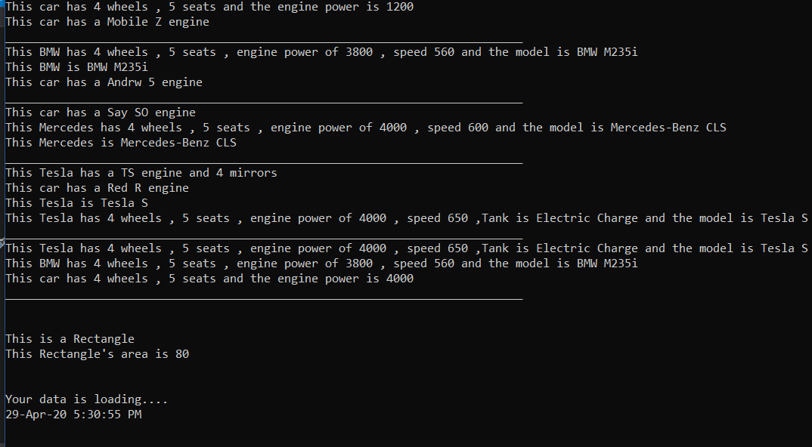

# OOP

 OOP is an abbreviation of Object Oriented Programming system in which programs are considered as a collection of objects. Each object is nothing but an instance of a class. OOP is a very important topic in programming and every programmer must know how to use it in his code.
So in this project I tried to cover some of the main concepts of the Object-Oriented Programming (OOP) using C#
and I used :

 <ol>
  <li>Classes.</li>
  <li>Objects.</li>
  <li>Encapsulation.</li>
  <li>Inheritance.</li>
  <li>Polymerphism.</li>
  <li>Abstraction</li>
  <li>Interface</li>
</ol> 

## Getting Started

Go ahead and download the zip file then open the .sln file. You will have the full project click run and you should see this screen : 

    

The previous screen shows the results of different classes and methods.

## Project Structure

    

In those four classes

## Prerequisites

Visual Studio 2017 or higher. 

## Installing

Find the Visual Studio versions in this link : 
<a href="https://visualstudio.microsoft.com/downloads/" target="_blank">Visual Studio Download</a>

## Code

In this project I used : 
 <ol>
  <li>Classes.
    <ul>
      <li>Base class.</li>
      <li>Derived class.</li>
    </ul>
  </li>
  <li>Access Modifiers
    <ul>
      <li>Public : public access modifiers are accessible from everywhere in our project. </li>
      <li>Private :  private access modifiers are accessible only inside a class. </li>
      <li>Protected : protected access modifiers are accessible inside the class and in all classes that derive from that class.</li>
    </ul>
  </li>
  <li>Inheritance.</li>
  <li>Polymerphism.
  <ul>
      <li>Method Overloading : two functions with the same name but different signature.</li>
      <li>Method Overriding : two functions with the same name and signature but different body.</li>
      <li>Method Hiding : (using new keyword) the new modifier hides an accessible base class method.</li>
    </ul>
  </li>
  <li>Abstract.
   <ul>
      <li>Abstract class : means that you can't instantiate an object from this class.</li>
      <li>Abstract method : means that this method can't have a body and you're forced to write an implementation everytime you inherit 
      the class of this method.</li>
    </ul>
  </li>
  <li>Interface : when using interface you can only write the definition of the methods not the implementation 
  and you only implement those methods in the derived class.</li>
</ol> 

